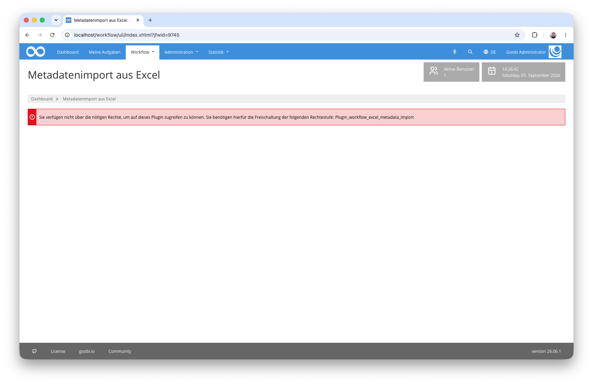
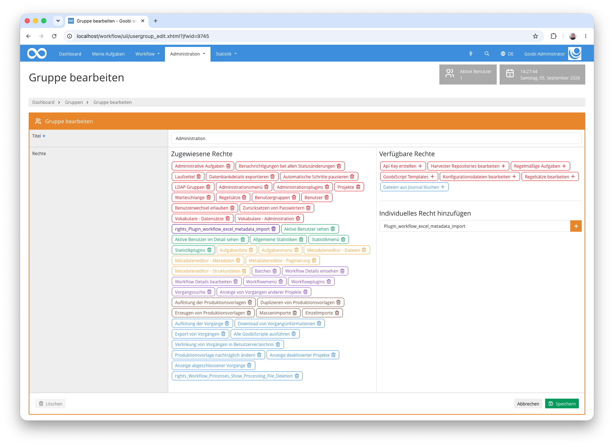
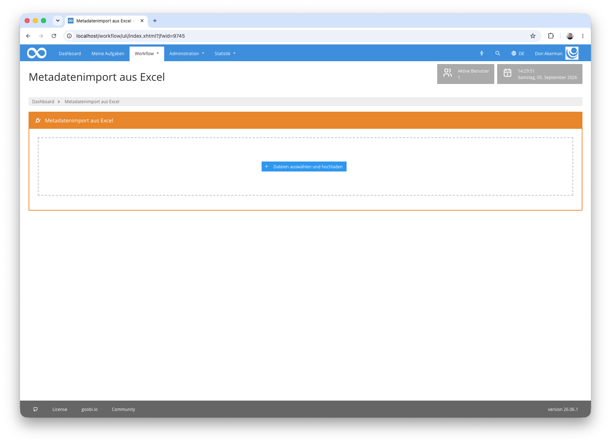

## Einführung
Dieses Workflow-Plugin ermöglicht den Massenimport von Metadaten aus einer Excel-Datei (`.xlsx`, `.xls`) in bestehende Goobi-Vorgänge. Nach dem Upload wird die Kopfzeile der Tabelle analysiert, die Spalten werden den verfügbaren Metadatenfeldern zugeordnet, und anschließend werden die Daten zeilenweise in die entsprechenden Vorgänge geschrieben.

## Installation
Um das Plugin nutzen zu können, müssen folgende Dateien installiert werden:

```bash
/opt/digiverso/goobi/plugins/workflow/plugin-workflow-excel-metadata-import-base.jar
/opt/digiverso/goobi/plugins/GUI/plugin-workflow-excel-metadata-import-gui.jar
/opt/digiverso/goobi/config/plugin_intranda_workflow_excel_metadata_import.xml
```

Für eine Nutzung dieses Plugins muss der Nutzer über die korrekte Rollenberechtigung verfügen.



Bitte weisen Sie daher der Gruppe die Rolle `Plugin_workflow_excel_metadata_import` zu.




## Überblick und Funktionsweise
Wenn das Plugin korrekt installiert und konfiguriert wurde, ist es innerhalb des Menüpunkts `Workflow` zu finden.



### Ablauf

**1. Excel-Datei hochladen**

Im oberen Bereich der Oberfläche befindet sich eine Upload-Komponente. Die Datei kann per Drag & Drop oder über den Dateiauswahldialog übergeben werden. Unterstützte Formate sind `.xlsx` und `.xls`. Eine Beispieldatei zum Testen liegt unter [metadata.xlsx](metadata.xlsx).

**2. Analyse der Kopfzeile**

Nach dem Upload liest das Plugin die erste Zeile der Tabelle als Kopfzeile ein. Dabei wird geprüft, ob mindestens eine Spalte einem der konfigurierten Werte aus `processIdField` oder `processTitleField` entspricht (Groß-/Kleinschreibung wird ignoriert).

- Wird eine passende **ID-Spalte** gefunden, wird der Vorgang über die numerische Vorgangs-ID gesucht.
- Wird eine passende **Titel-Spalte** gefunden, wird der Vorgang über den exakten Vorgangstitel gesucht.
- Wird **keine** passende Spalte gefunden, bricht das Plugin mit einer Fehlermeldung ab.

Sind sowohl eine ID- als auch eine Titel-Spalte vorhanden, wird ausschließlich die ID-Spalte zur Identifikation verwendet. Beide Spalten werden in der Zuordnungstabelle nicht angezeigt und dienen nur der Identifikation des Vorgangs.

Außerdem wird bereits beim Upload der Vorgang der ersten Datenzeile geladen, da aus dessen Regelsatz die auswählbaren Metadatenfelder stammen. Existiert dieser Vorgang nicht, bricht das Plugin ebenfalls mit einer Fehlermeldung ab.

**3. Spaltenzuordnung**

Alle übrigen Spalten werden in einer Tabelle dargestellt. Für jede Spalte kann über ein Dropdown-Menü ein Metadatenfeld aus dem Regelsatz des ersten gefundenen Vorgangs ausgewählt werden. Das Plugin versucht dabei, Spaltenname und Metadatenbezeichnung automatisch zuzuordnen (Vergleich mit internem Namen sowie deutscher und englischer Bezeichnung).

Zusätzlich kann pro Spalte über Radio-Buttons festgelegt werden, ob vorhandene Metadaten desselben Typs **ergänzt** oder **ersetzt** werden sollen. Spalten, denen kein Metadatenfeld zugeordnet ist, werden beim Import ignoriert.

**4. Import starten**

Über den Import-Button werden alle Datenzeilen verarbeitet. Für jede Zeile wird der Vorgang geladen, die zugeordneten Metadaten geschrieben und die Metadaten-Datei gespeichert. Zeilen ohne Identifikationswert werden übersprungen; Zeilen, deren Vorgang nicht gefunden wird oder bei denen ein Fehler auftritt, werden als Fehler gezählt, der Import läuft mit der nächsten Zeile weiter. Am Ende wird eine Zusammenfassung mit der Anzahl der erfolgreich und der fehlerhaft importierten Zeilen angezeigt.

Beim Schreiben der Metadaten gelten folgende Regeln:

- Die Metadaten werden in das oberste logische Strukturelement des Vorgangs geschrieben. Bei mehrbändigen Werken (Anchor) wird das erste untergeordnete Strukturelement verwendet.
- Leere Zellen werden übersprungen. Das gilt auch im Modus **ersetzen**: Vorhandene Metadaten werden nur dann entfernt, wenn die Zelle einen Wert enthält.
- Bei **Personen** wird der Zellwert in Vor- und Nachname zerlegt: Enthält der Wert ein Komma, gilt die Form `Nachname, Vorname` (Trennung am letzten Komma). Enthält er kein Komma, aber ein Leerzeichen, gilt die Form `Vorname Nachname` (Trennung am letzten Leerzeichen). Ein Wert ohne Komma und Leerzeichen wird als Vorname übernommen.
- Bei **Körperschaften** wird der Zellwert als Hauptname übernommen.
- Alle anderen Metadatentypen erhalten den Zellwert unverändert als Wert.


## Konfiguration
Die Konfiguration des Plugins erfolgt in der Datei `plugin_intranda_workflow_excel_metadata_import.xml` wie hier aufgezeigt:

{{CONFIG_CONTENT}}

Die folgende Tabelle enthält eine Zusammenstellung der Parameter und ihrer Beschreibungen:

Parameter               | Erläuterung
------------------------|------------------------------------
`processIdField`        | Mögliche Spaltennamen für die Vorgangs-ID-Spalte. Es können mehrere Werte angegeben werden. Der Vergleich erfolgt ohne Berücksichtigung der Groß-/Kleinschreibung. Wird eine solche Spalte gefunden, wird der Vorgang über die numerische ID geladen.
`processTitleField`     | Mögliche Spaltennamen für die Vorgangstitel-Spalte. Es können mehrere Werte angegeben werden. Der Vergleich erfolgt ohne Berücksichtigung der Groß-/Kleinschreibung. Wird eine solche Spalte gefunden, wird der Vorgang über den exakten Titel gesucht.
