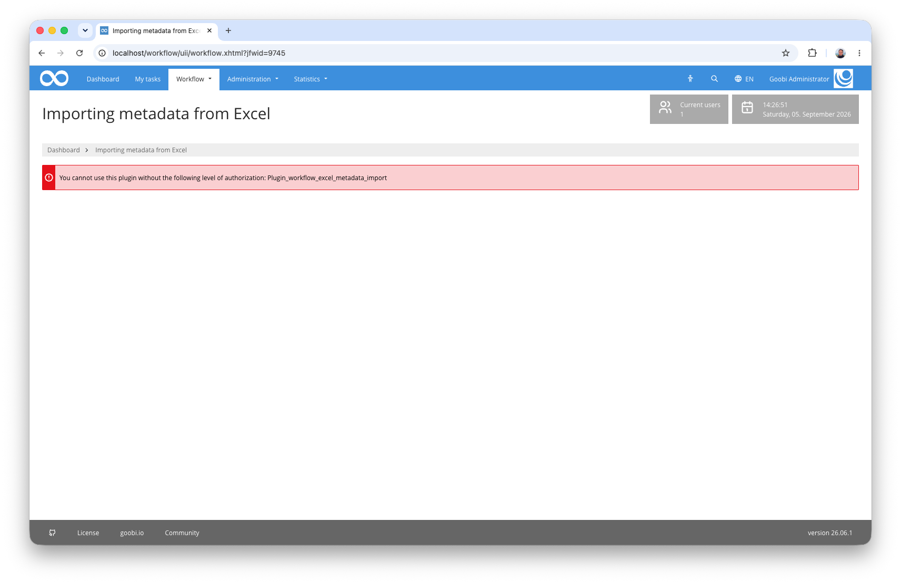
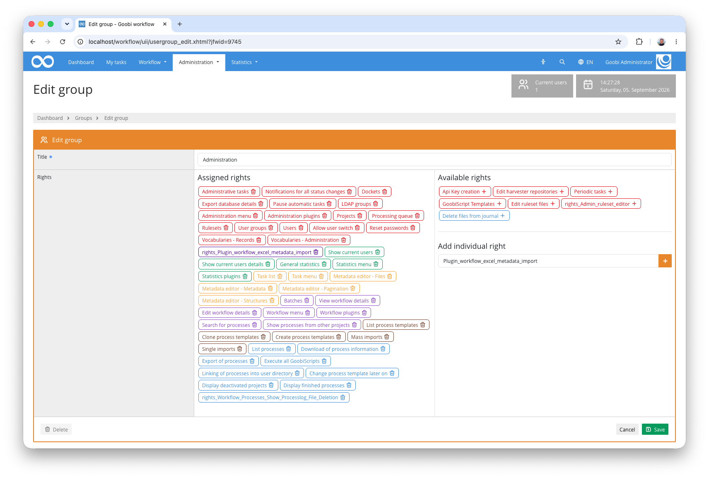
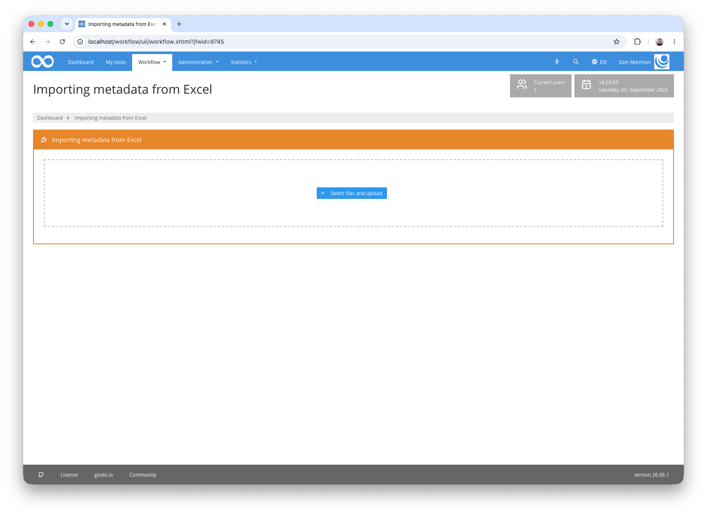
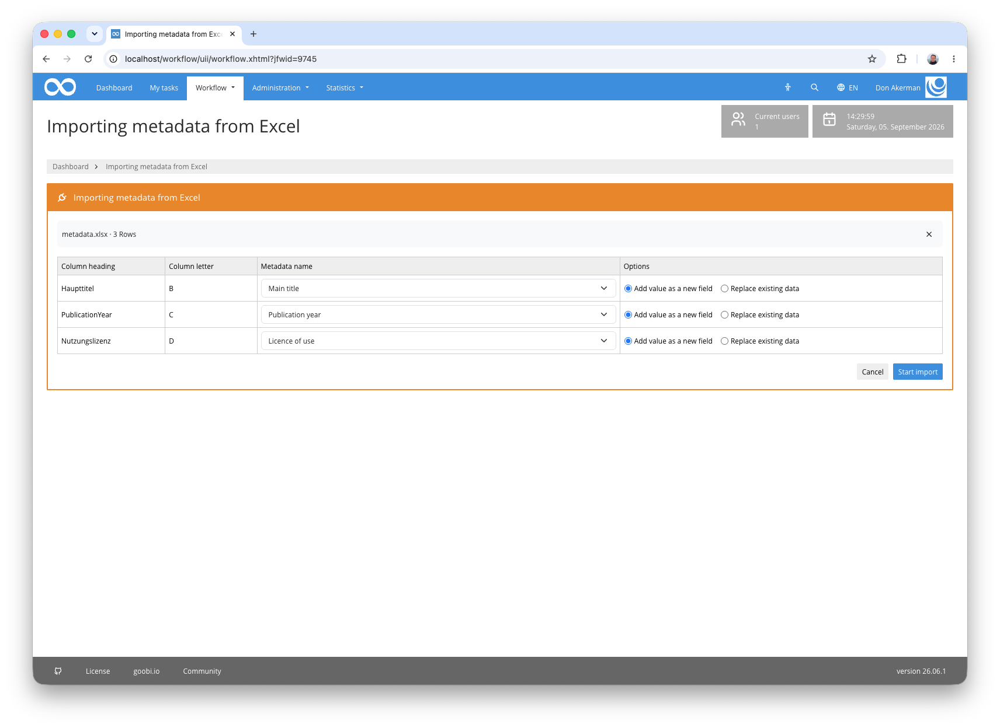

## Introduction
This workflow plugin enables the bulk import of metadata from an Excel file (`.xlsx`, `.xls`) into existing Goobi processes. After uploading, the header row of the spreadsheet is analysed, columns are mapped to the available metadata fields, and the data is then written row by row into the corresponding processes.

## Installation
In order to use the plugin, the following files must be installed:

```bash
/opt/digiverso/goobi/plugins/workflow/plugin-workflow-excel-metadata-import-base.jar
/opt/digiverso/goobi/plugins/GUI/plugin-workflow-excel-metadata-import-gui.jar
/opt/digiverso/goobi/config/plugin_intranda_workflow_excel_metadata_import.xml
```

To use this plugin, the user must have the correct role authorisation.



Therefore, please assign the role `Plugin_workflow_excel_metadata_import` to the group.




## Overview and functionality
If the plugin has been installed and configured correctly, it can be found under the `Workflow` menu item.



### Procedure

##### 1. Upload the Excel file

The upper section of the interface contains an upload component. The file can be provided via drag & drop or through the file selection dialog. Supported formats are `.xlsx` and `.xls`. A sample file for testing is available at [metadata.xlsx](metadata.xlsx).

#### 2. Header row analysis

After uploading, the plugin reads the first row of the spreadsheet as the header row. It checks whether at least one column matches one of the configured values from `processIdField` or `processTitleField` (case-insensitive comparison).

- If a matching **ID column** is found, the process is looked up by its numeric process ID.
- If a matching **title column** is found, the process is looked up by its exact process title.
- If **no** matching column is found, the plugin aborts with an error message.

If both an ID column and a title column are present, only the ID column is used for identification. Both columns are excluded from the mapping table and serve solely to identify the process.

In addition, the process of the first data row is already loaded during upload, as the selectable metadata fields are taken from its ruleset. If this process does not exist, the plugin also aborts with an error message.

#### 3. Column mapping

All remaining columns are displayed in a table. For each column, a metadata field from the ruleset of the first matched process can be selected via a dropdown menu. The plugin attempts to automatically assign a metadata field by comparing the column name with the internal name as well as the German and English labels of each metadata type.

Additionally, radio buttons on each row allow you to specify whether existing metadata of the same type should be **added to** or **replaced**. Columns without an assigned metadata field are ignored during import.



#### 4. Start the import

Clicking the import button processes all data rows. For each row the process is loaded, the mapped metadata is written, and the metadata file is saved. Rows without an identification value are skipped; rows whose process cannot be found or which cause an error are counted as errors, and the import continues with the next row. At the end, a summary showing the number of successfully and unsuccessfully imported rows is displayed.

The following rules apply when writing the metadata:

- The metadata is written to the top-level logical structure element of the process. For multi-volume works (anchor), the first child structure element is used.
- Empty cells are skipped. This also applies in **replace** mode: existing metadata is only removed if the cell contains a value.
- For **persons**, the cell value is split into first name and last name: if the value contains a comma, the form `Lastname, Firstname` is assumed (split at the last comma). If it contains no comma but a space, the form `Firstname Lastname` is assumed (split at the last space). A value without comma or space is taken as the first name.
- For **corporate bodies**, the cell value is used as the main name.
- All other metadata types receive the cell value unchanged.


## Configuration
The plugin is configured in the file `plugin_intranda_workflow_excel_metadata_import.xml` as shown here:

{{CONFIG_CONTENT}}

The following table contains a summary of the parameters and their descriptions:

Parameter               | Explanation
------------------------|------------------------------------
`processIdField`        | Possible column names for the process ID column. Multiple values can be specified. The comparison is case-insensitive. If such a column is found, the process is loaded by its numeric ID.
`processTitleField`     | Possible column names for the process title column. Multiple values can be specified. The comparison is case-insensitive. If such a column is found, the process is looked up by its exact title.
